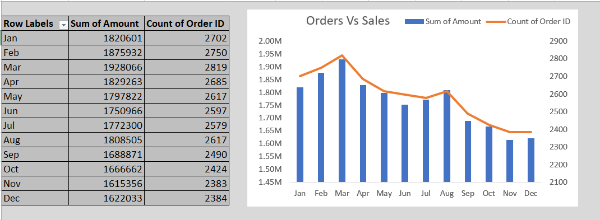
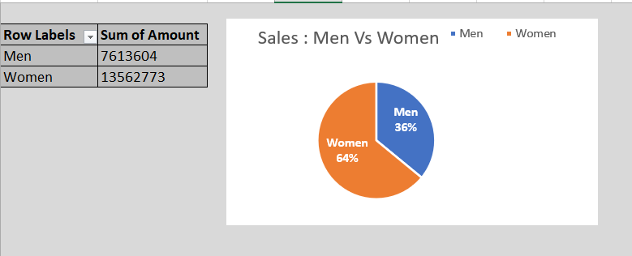
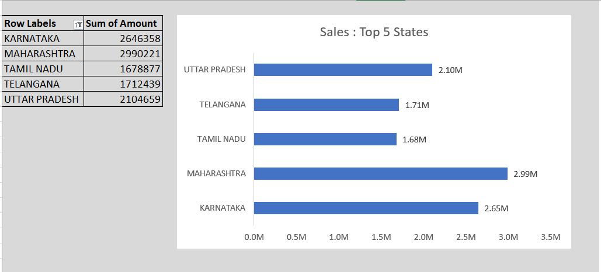
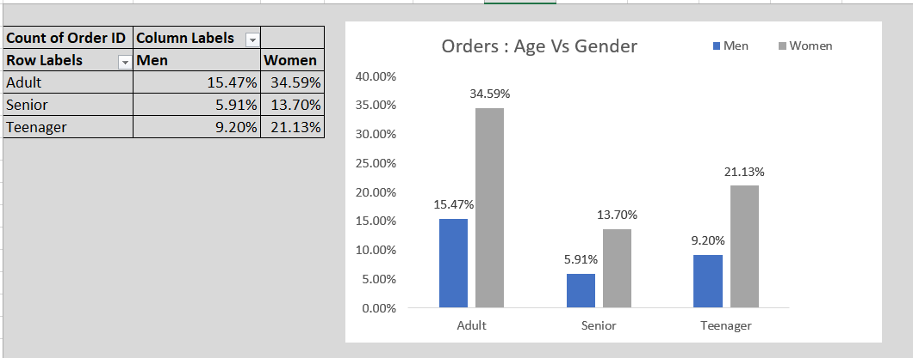
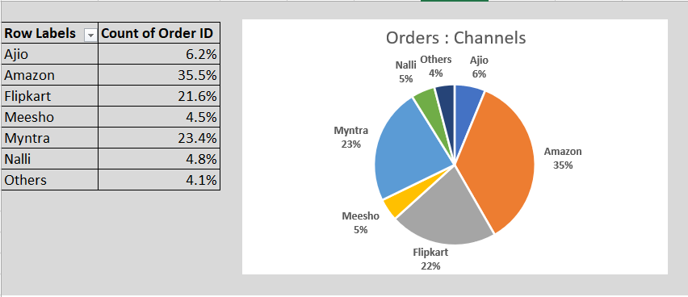

# NovaMart Retail Sales Analytics

## Project Overview

This project focuses on analyzing retail sales data to uncover customer purchasing behavior, sales trends, revenue insights, and overall business performance using Microsoft Excel.

The project demonstrates practical data analytics skills including:
- Data Cleaning
- Data Visualization
- Dashboard Creation
- KPI Tracking
- Business Insight Generation

---

# Business Objective

The main objective of this project is to:

- Analyze retail sales performance
- Identify top-performing states and sales channels
- Understand customer demographics and purchasing behavior
- Track monthly sales and order trends
- Generate actionable business insights

---

# Tools & Technologies Used

- Microsoft Excel
- Pivot Tables
- Pivot Charts
- Data Cleaning
- Conditional Formatting
- Dashboard Design
- KPI Analysis

---

# Dataset Information

The dataset contains retail transaction records including:

- Customer demographics
- Product categories
- Sales amount
- Order details
- Sales channels
- Order status
- State-wise sales performance
- Monthly sales trends

---

# Key Performance Indicators (KPIs)

- Total Sales Revenue
- Total Orders
- Top Performing States
- Customer Demographics
- Monthly Sales Growth
- Sales Channel Performance
- Category-wise Revenue

---

# Dashboard Features

- Interactive Excel Dashboard
- Monthly Sales Trend Analysis
- Customer Segmentation Analysis
- State-wise Revenue Analysis
- Sales Channel Performance
- Order Status Tracking

---

# Dashboard Preview

## Dashboard Overview


---

## Monthly Sales & Order Performance



---

## Customer Gender Analysis



---

## Top Performing States by Revenue



---

## Customer Demographics Analysis



---

## Sales Performance by Channels



---

# Key Business Insights

- Maharashtra generated the highest sales revenue.
- Women customers contributed major sales volume.
- Adult customers represented the largest purchasing group.
- Amazon and Myntra contributed significant sales.
- Monthly sales peaked during March.
- Seasonal trends influenced overall revenue performance.

---

# Conclusion

This project demonstrates how data analytics can help retail businesses identify trends, optimize performance, and improve decision-making using Excel dashboards and visual analytics.

The project also highlights practical business intelligence and reporting skills relevant to Data Analyst roles.

---

# Project Structure

```text
NovaMart-Retail-Sales-Analytics
│
├── Dataset
│   └── NovaMart_Retail_Analysis.xlsx
│
├── Dashboard_Screenshots
│   ├── Dashboard_Overview.png
│   ├── Sales_Trend_Analysis.png
│   ├── Customer_Gender_Analysis.png
│   ├── Top_States_Analysis.png
│   ├── Age_Group_Analysis.png
│   └── Sales_Channel_Analysis.png
│
├── README.md
└── Insights_Report.pdf
```

---

# Future Improvements

Future enhancements may include:

- Power BI Dashboard Integration
- SQL-based Data Analysis
- Python Data Visualization
- Predictive Sales Forecasting
- Automated Reporting Systems

---

# Author

## Shradha Singh

MCA Graduate | Data Analyst Enthusiast

---

# Connect With Me

- GitHub: https://github.com/Shradha-08

---

# GitHub Topics

`data-analysis` `excel-dashboard` `retail-analytics` `business-analysis` `sales-analysis` `dashboard`
